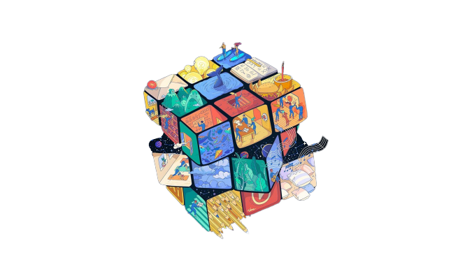
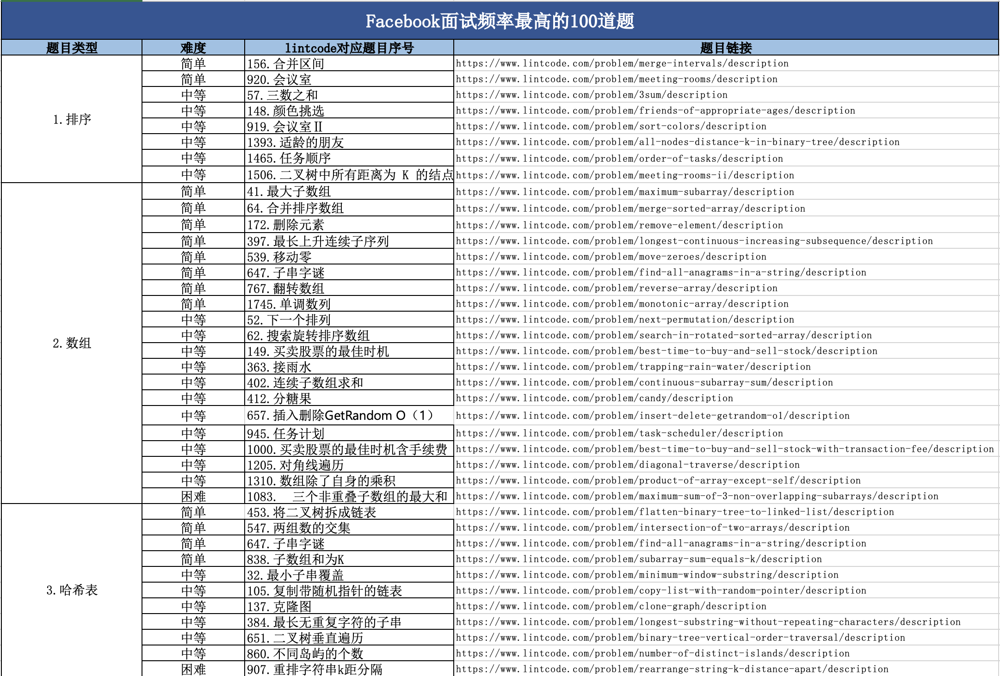
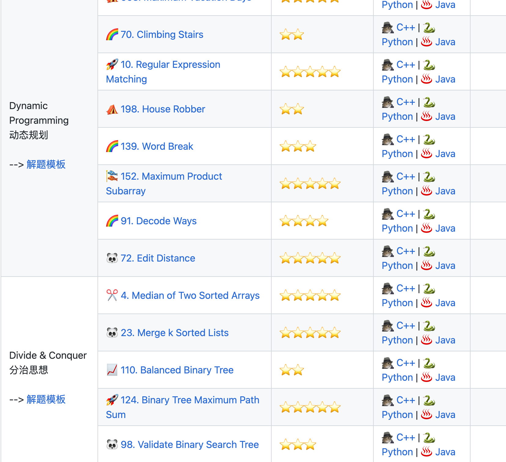
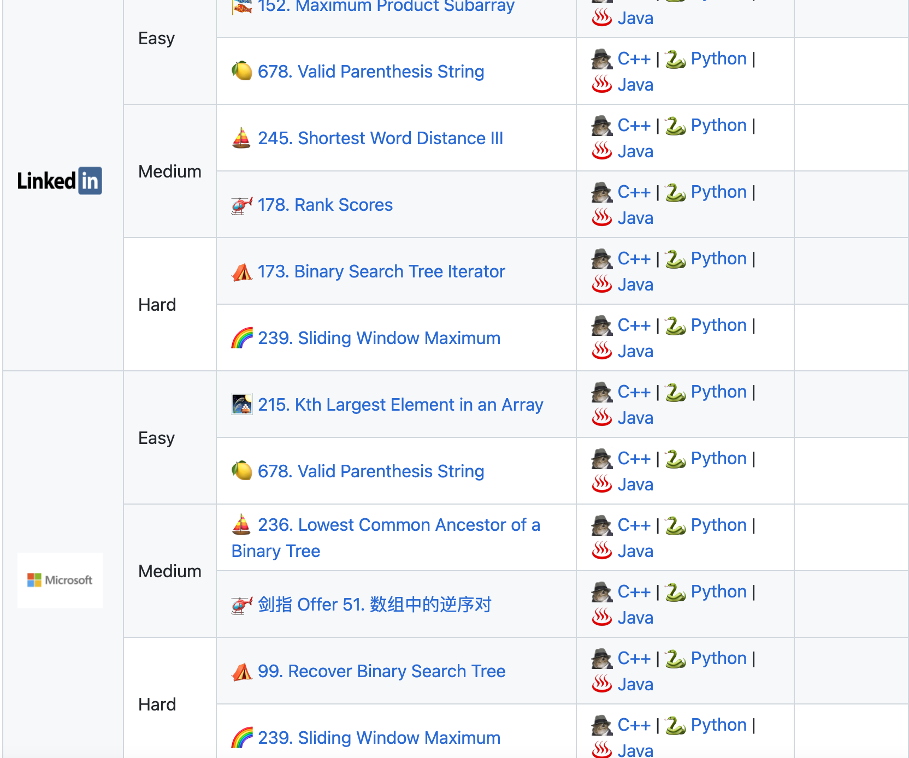

🌍 English | [简体中文](README-zh_CN.md)| [日本語](README-jp_JP.md) | [Українською](README-uk_UA.md)
 

  <!--
	
  -->
  
     
    
C++ Master Learning Roadmap

    

      
      
      
      
      
    

    

        <a href="https://github.com/Charmve/CppMaster/tree/main/code">Quickstart</a> •
        <a href="https://github.com/Charmve/CppMaster/tree/main/notebooks">Notebook</a> •
        <a href="https://github.com/Charmve/CppMaster/issues">Community</a>  •
        <a href="https://charmve.github.io/CppMaster/">Docs</a> 
    

----
<b>Note: Please raise an issue for any suggestions, corrections, and feedback.</b>

The goal of this repo is to buid a advanced C++ programing tech stack for a higher salary.

 

## Waking-Up
> 大多数人都高估了他们一天能做的事情，但低估了他们一年能做的事情

 

<b>

💡 关于
</b>

📚 本仓库是面向 C/C++ 技术方向校招求职者、初学者的基础知识总结，包括语言、程序库、数据结构、算法、系统、网络、链接装载库等知识及面试经验、招聘、内推等信息。

💡 侧边目录支持方式：[📚 Docsify 文档](https://charmve.github.io/CppMaster/)、[Github + TOC 导航](https://github.com/jawil/GayHub)（[TOC预览.png](https://gitee.com/huihut/interview/raw/master/images/TOC预览.png)）

📄 保存为 PDF 方式：使用 Chrome 浏览器打开 <a href="https://charmve.github.io/CppMaster/">📚 Docsify 文档</a> 页面，缩起左侧目录-右键 - 打印 - 选择目标打印机是另存为PDF - 保存（[打印预览.png](https://gitee.com/huihut/interview/raw/master/images/打印预览.png)）

🙏 仓库内容如有错误或改进欢迎 issue 或 pr。由于本人水平有限，仓库中的知识点有来自本人原创、读书笔记、书籍、博文等，非原创均已标明出处，如有遗漏，请 issue 提出。本仓库遵循 [CC BY-NC-SA 4.0（署名 - 非商业性使用 - 相同方式共享）](https://github.com/huihut/interview/blob/master/LICENSE) 协议，转载请注明出处，不得用于商业目的。

### Table of Content

- [⭐️ JD Cases](#%EF%B8%8F-jd-cases)
- [➕ C/C++](#-c)
  - [📦 STL](#-stl)
  - [⚙️ 链接装载库](#%EF%B8%8F-编译链接与调试)
- [💻 操作系统](#-操作系统)
- [☁️ 计算机网络](#%EF%B8%8F-计算机网络)
- [💾 数据库](#-数据库)
- [📏 设计模式](#-设计模式)
- [🐳 容器化技术](#容器化技术)
- [🔱 C/C++ 发展方向](#cc-development-direction)
- [📝 面试题目经验](#interview-questions-experience)
- [📚 书籍](#-书籍)
- [👍 内推](https://www.nowcoder.com/discuss/786270)
- [👬 贡献者]()
- [📜 License](LICENSE)

----

 

## ⭐️ JD Cases

| | | |
|--|--|--|
| | | |
| | | |
| | |  |

[Index](#table-of-content)

 

## ➕ C++

问题列表，详细解答可参考: [C++面经汇总](./C++面经汇总/basic_cpp.md)

1、面向对象的三大特性：封装、继承、多态

2、类的访问权限：private、protected、public

3、类的构造函数、析构函数、赋值函数、拷贝函数

4、移动构造函数与拷贝构造函数对比

5、深拷贝与浅拷贝的区别

6、空类有哪些函数？空类的大小？

7、内存分区：全局区、堆区、栈区、常量区、代码区

8、C++与C的区别

9、struct与class的区别

10、struct、union 内存对齐

11、new/delete与malloc/free的区别

12、内存泄露的情况分析

13、sizeof与strlen对比

14、指针与引用的区别

- C语言的指针和引用和c++的有什么区别？

15、野指针产生与避免

16、多态：动态多态、静态多态

17、虚函数实现动态多态的原理、虚函数与纯虚函数的区别

18、继承时，父类的析构函数是否为虚函数？构造函数能不能为虚函数？为什么？

19、静态多态：重写、重载、模板

20、static关键字：修饰局部变量、全局变量、类中成员变量、类中成员函数

- C 语言的关键字static和 C++ 的关键字static有什么区别

21、const关键字：修饰变量、指针、类对象、类中成员函数

22、extern关键字：修饰全局变量

23、volatile关键字：避免编译器指令优化

- 一个参数可以既是const又是volatile吗

24、四种类型转换：static_cast、dynamic_cast、const_cast、reinterpret_cast

25、C++11 部分新特性，比如右值引用、完美转发等

- 什么是右值引用，跟左值又有什么区别？

- 完美转发

26、std::move函数

27、四种智能指针及底层实现：auto_ptr、unique_ptr、shared_ptr、weak_ptr

28、shared_ptr中的循环引用怎么解决？（weak_ptr）

- [shared_ptr](https://blog.csdn.net/shaosunrise/article/details/85228823) 和 unique_ptr

29、vector与list比较

- vector的底层原理
- list的底层原理
- vector中的reserve和resize的区别
- vector中的size和capacity的区别
- vector中erase方法与algorithn中的remove方法区别
- 正确释放vector的内存(clear(), swap(), shrink_to_fit())
- vector迭代器失效的情况
- 什么情况下用vector，什么情况下用list，什么情况下用 deque

30、priority_queue的底层原理

31、STL部分容器的实现原理，如 vector、deque、map、hashmap、set、list

- map与unordered_map对比
- [set\map机制](https://blog.csdn.net/solstice/article/details/8521946)
- map 、set、multiset、multimap的底层原理
- map 、set、multiset、multimap的特点
- 为何map和set的插入删除效率比其他序列容器高
- 为何map和set每次Insert之后，以前保存的iterator不会失效？
- 当数据元素增多时（从 10000 到 20000），map的set的查找速度会怎样变化？
- 为何map和set的插入删除效率比其他序列容器高，而且每次insert 之后，以前保存的iter
- 为何map和set不能像vector一样有个reserve函数来预分配数据?
- set的底层实现实现为什么不用哈希表而使用红黑树？
- hash_map与map的区别？什么时候用hash_map，什么时候用map？

32、set与unordered_set对比

33、STL容器空间配置器

- [📦 STL](http://c.biancheng.net/stl/)，
- STL线程不安全的情况

34、变量的声明和定义有什么区别

35、简述``strcpy``、``sprintf``与``memcpy``的区别

36、请解析`(*(void (*)( ) )0)( )`的含义

37、设置地址为``0x67a9``的整型变量的值为0xaa66

38、简述指针常量与常量指针的区别

39、请你来说一下 C++ 中struct和class的区别

40、简述`#ifdef`、`#else`、`#endif`和`#ifndef`的作用

41、`typedef`和`define`有什么区别

- 写一个 “标准”宏MIN

42、写出int 、bool、 float、指针变量与 “零值”比较的if语句

43、结构体可以直接赋值吗

44、谈谈你对拷贝构造函数和赋值运算符的认识

45、sizeof和strlen的区别

46、关键字 override
- 简述类成员函数的重写、重载和隐藏的区别

47、C++ 自己实现一个String类

48、用两个栈实现一个队列的功能

49、高级数据结构

- 红黑树
- B B+树
- 图

50、编译链接机制、内存布局（memory layout）、对象模型

> 参考书籍：《C++ Primer》（第5版）、《STL源码剖析》、

[Index](#table-of-content)

 

## 高性能优化
- 分析工具 gpertool、[profiling](https://zhuanlan.zhihu.com/p/362575905)
- 掌握多线程优化方法，熟悉基本的资源调度方法；

### Xavier
- [CUDA编程之快速入门](https://www.cnblogs.com/skyfsm/p/9673960.html)

## 高性能计算

- CUDA 并行编程模型及常用优化方法，熟悉基于 TensorRT 编程方法；
- 熟练掌握CUDA程序性能分析、问题定位及调试的能力，掌握对应 CUDA 工具的使用；
- 熟悉 PTX/SASS，有编译优化经验；

[Index](#table-of-content)

 

## 💻 操作系统

1、进程与线程区别

2、线程同步的方式：互斥锁、自旋锁、读写锁、条件变量

3、互斥锁与自旋锁的底层区别

4、孤儿进程与僵尸进程

5、死锁及避免

6、多线程与多进程比较

7、进程间通信：PIPE、FIFO、消息队列、信号量、共享内存、socket

8、管道与消息队列对比

9、fork进程的底层：读时共享，写时复制

10、线程上下文切换的流程

11、进程上下文切换的流程

12、进程的调度算法

13、阻塞IO与非阻塞IO

14、同步与异步的概念

15、静态链接与动态链接的过程

16、虚拟内存概念（非常重要）

17、MMU地址翻译的具体流程

18、缺页处理过程

19、缺页置换算法：最久未使用算法、先进先出算法、最佳置换算法

> 参考书籍：《Unix环境高级编程》、《Linux多线程服务器端编程》

[Index](#table-of-content)

#### 文件系统

#### I/O
#### [内存管理](https://github.com/Charmve/CppMaster/blob/master/操作系统/内存管理问题合集.md)
##### 虚拟内存
##### [共享内存](https://blog.csdn.net/ypt523/article/details/79958188)
#### [进程和线程](https://github.com/Charmve/CppMaster/blob/master/操作系统/进程与线程问题合集.md)
##### 多线程/线程池
##### 时间轮转片
##### 并行计算 GPU/NPU 
- [OpenCL & Cuda]()
- 
##### [Socket问题合集](https://github.com/Charmve/CppMaster/blob/master/计算机网络/Socket问题合集.md)

### Linux

- [信号 signal](https://blog.csdn.net/qq_27085429/article/details/95041443)
- [常用命令](https://www.jianshu.com/p/73556e1a1236)
- 环境变量
- 动态链接/静态链接
- [正则表达式](https://www.runoob.com/regexp/regexp-metachar.html)
- [目录挂载](https://blog.csdn.net/dear_little_bear/article/details/108474499)

#### [vim](https://www.jianshu.com/p/fbb00627163c)

#### git

#### ⚙️ 编译、链接与调试
- [链接问题合集](https://github.com/Charmve/CppMaster/blob/master/操作系统/链接问题合集.md)
  - [C语言调用so动态库的两种方式](https://blog.csdn.net/shaosunrise/article/details/81161064)
- [Cmake](https://www.hahack.com/codes/cmake/) - [Makefile](https://www.jianshu.com/p/442e71755643)，[CMakeLists.txt](https://blog.csdn.net/shaosunrise/article/details/121103842)
  - [跟我一起写Makefile](https://github.com/seisman/how-to-write-makefile)
- [GDB/CGDB](https://www.jianshu.com/p/8d0278ae7e07)
- [gtest](https://blog.csdn.net/linhai1028/article/details/81675724)

##### [Shell/bash](https://www.runoob.com/linux/linux-shell.html)

##### Bootloader/Uboot/buildboot

### RTOS/FreeRTOS

### [ROS](http://wiki.ros.org/cn/ROS/Tutorials)

### [QNX](https://blackberry.qnx.com/en)

[Index](#table-of-content)

### 容器化技术
- [Docker](https://vuepress.mirror.docker-practice.com/)
- K8S

### ARM x86

[Index](#table-of-content)

 

### 虚拟化技术
- [Qemu]()
- KVM
- Hypervisor

[Index](#table-of-content)

 

### 缓存/并发技术

- [Kafka](https://zhuanlan.zhihu.com/p/446774729)

## ☁️ 计算机网络

#### [网络基础问题合集](https://github.com/Charmve/CppMaster/blob/master/计算机网络/网络基础问题合集.md)
#### [HTTP问题合集](https://github.com/Charmve/CppMaster/blob/master/计算机网络/HTTP问题合集.md)

[Index](#table-of-content)

 

## 网络编程

Linux 下网络编程核心的包括<b>系统编程</b>和<b>网络 IO </b>两个部分：

1、进程间通信方式：信号量、管道、共享内存、socket 等

2、多线程编程：互斥锁、条件变量、读写锁、线程池等

3、五大 IO 模型：同步、异步、阻塞、非阻塞、信号驱动 区别/联系

4、线程池

5、高性能 IO 两种模式：Reactor 和 Proactor（ 但是 Linux 下由于缺少异步 IO 支持，基本没有 Proactor)

6、IO多路复用：select、poll、epoll的区别（非常重要，几乎必问，回答得越底层越好，要会使用）

7、手撕一个最简单的server端服务器（socket、bind、listen、accept这四个API一定要非常熟练）

8、边沿触发与水平触发的区别

> 参考书籍：《Unix网络编程》

[Index](#table-of-content)

 

## 📏 [设计模式](./code/DesignPattern)
- [OOP设计和设计模式](https://blog.csdn.net/weixin_45748233/article/details/106808059)
-
[Index](#table-of-content)

 

## 💾 [数据库](./数据库)

关系型与非关系型

#### [MySQL问题合集.md](https://github.com/Charmve/CppMaster/blob/master/数据库/MySQL问题合集.md)
#### [MongoDB](https://www.runoob.com/mongodb/mongodb-tutorial.html)

 

[Index](#table-of-content)

## CI/CD
### .yaml

[Index](#table-of-content)

 

## 📚 [书籍](./FreeEBooks)

链接:https://github.com/Charmve/PaperWeeklyAI/tree/master/00_GuideBooksPDF(English%2BChinese)

> 更多免费电子书，<b>公众号：迈微AI研习社</b>回复 ``“电子书”`` ，可免费获取。

[Index](#table-of-content)

  

## 职位要求
(初级 -> 高级)

1. 熟练使用 C/C++ 编程语言，有良好的编码习惯，掌握语言级别的程序性能优化技巧
2. 掌握至少一种脚本语言的使用 python/shell
3. 熟悉编译过程，熟练使用 CMake 编译脚本，熟悉跨平台交叉编译（x86/ARM）
4. 熟悉 GDB 调试、Profiling 工具使用，对于代码和性能优化有经验
5. 了解 GPU/NPU 等并行计算芯片的使用
6. 熟悉常见关系型数据库、非关系型mongoDb、redis、消息队列等组件，并了解其基本原理 
7. 有高并发服务设计和实现经验、对分布式系统，微服务有深刻的了解，有良好的可靠性意识，包括不限于监控，容灾等
8. 有良好的业务抽象能力和业务建模能力

[Index](#table-of-content)

 

## 🔱 C/C++ 发展方向

> C/C++ 发展方向甚广，包括不限于以下方向， 以下列举一些大厂校招岗位要求。

### 后台/服务器

【后台开发】

* 编程基本功扎实，掌握 C/C++/JAVA 等开发语言、常用算法和数据结构；
* 熟悉 TCP/UDP 网络协议及相关编程、进程间通讯编程；
* 了解 Python、Shell、Perl 等脚本语言；
* 了解 MYSQL 及 SQL 语言、编程，了解 NoSQL, key-value 存储原理；
* 全面、扎实的软件知识结构，掌握操作系统、软件工程、设计模式、数据结构、数据库系统、网络安全等专业知识；
* 了解分布式系统设计与开发、负载均衡技术，系统容灾设计，高可用系统等知识。

### 桌面客户端

【PC 客户端开发】

* 计算机软件相关专业本科或以上学历，热爱编程，基础扎实，理解算法和数据结构相关知识；  
* 熟悉 windows 操作系统的内存管理、文件系统、进程线程调度； 
* 熟悉 MFC/windows 界面实现机制，熟练使用 VC，精通 C/C++，熟练使用 STL，以及 Windows 下网络编程经验；
* 熟练掌握 Windows 客户端开发、调试，有 Windows 应用软件开发经验优先；
* 对于创新及解决具有挑战性的问题充满激情，具有良好的算法基础及系统分析能力。

### 图形学/游戏/VR/AR

【游戏客户端开发】

* 计算机科学/工程相关专业本科或以上学历，热爱编程，基础扎实，理解算法、数据结构、软件设计相关知识；
* 至少掌握一种游戏开发常用的编程语言，具 C++/C# 编程经验优先；
* 具游戏引擎（如 Unity、Unreal）使用经验者优先；
* 了解某方面的游戏客户端技术（如图形、音频、动画、物理、人工智能、网络同步）者优先考虑；
* 对于创新及解决具有挑战性的问题充满激情，有较强的学习能力、分析及解决问题能力，具备良好的团队合作意识；
* 具阅读英文技术文档能力；
* 热爱游戏。

### 测试开发

【测试开发】

* 计算机或相关专业本科及以上学历；
* 一至两年的 C/C++/Python 或其他计算机语言的编程经验；
* 具备撰写测试计划、测试用例、以及实现性能和安全等测试的能力；
* 具备实现自动化系统的能力；
* 具备定位调查产品缺陷能力、以及代码级别调试缺陷的能力；
* 工作主动积极，有责任心，具有良好的团队合作精神。

### 网络安全/逆向

【安全技术】

* 热爱互联网，对操作系统和网络安全有狂热的追求，专业不限；
* 熟悉漏洞挖掘、网络安全攻防技术，了解常见黑客攻击手法；  
* 掌握基本开发能力，熟练使用 C/C++ 语言；
* 对数据库、操作系统、网络原理有较好掌握；  
* 具有软件逆向，网络安全攻防或安全系统开发经验者优先。

### 嵌入式/物联网

【嵌入式应用开发】

* 有良好的编程基础，熟练掌握 C/C++ 语言；
* 掌握操作系统、数据结构等软件开发必备知识；
* 具备较强的沟通理解能力及良好的团队合作意识；
* 有 Linux/Android 系统平台的开发经验者优先。

### 音视频/流媒体/SDK

【音视频编解码】

1. 硕士及以上学历，计算机、信号处理、数学、信息类及相关专业和方向； 
2. 视频编解码基础扎实，熟常用的 HEVC 或 H264，有较好的数字信号处理基础； 
3. 掌握 C/C++，代码能力强, 熟悉一种汇编语言尤佳； 
4. 较强的英文文献阅读能力； 
5. 学习能力强，具有团队协作精神，有较强的抗压能力。

### 计算机视觉/机器学习

【计算机视觉研究】

* 计算机、应用数学、模式识别、人工智能、自控、统计学、运筹学、生物信息、物理学/量子计算、神经科学、社会学/心理学等专业，图像处理、模式识别、机器学习相关研究方向，本科及以上，博士优先；
* 熟练掌握计算机视觉和图像处理相关的基本算法及应用；
* 较强的算法实现能力，熟练掌握 C/C++ 编程，熟悉 Shell/Python/Matlab 至少一种编程语言；
* 在计算机视觉、模式识别等学术会议或者期刊上发表论文、相关国际比赛获奖、及有相关专利者优先。

## 📝 面试题目经验

- [docs/C++面经汇总](./C++面经汇总/basic_cpp.md)

- [如果你是一个C++面试官，你会问哪些问题？](https://www.zhihu.com/question/451327108/answer/2359217596)
- 我的专栏 [大厂后端/算法面经分类整理](https://blog.csdn.net/charmve/category_9622929.html)
- [华为、美团、微软、字节、阿里、360 校招研发编程测试题及答案参考](https://blog.csdn.net/charmve/category_9622929.html)
- [竞赛科创 | 电子信息创新设计项目实践](https://blog.csdn.net/charmve/category_9577245.html)
- [计算机视觉实战 | 练手项目，开放源码](https://blog.csdn.net/charmve/category_10595130.html)

 

## :rocket: 知识星球

专为求职面试中算法与数据结构的小伙伴，创了学习交流/刷题群（知识星球）！想要最快的提升算法与数据结构技能，和更多小伙伴一起来吧！

进群获取互联网大厂高频coding题库，告别刷题400道，分类整理的题库，算法思路和源代码实现配套，各个类型总结出来的解题模板，远比你一个人要强！

  <!---
    
  -->
  

## 参考

[1] interview. https://github.com/huihut/interview

[2] @Jeloys/HelloWorld. https://github.com/Jeloys/HelloWorld
